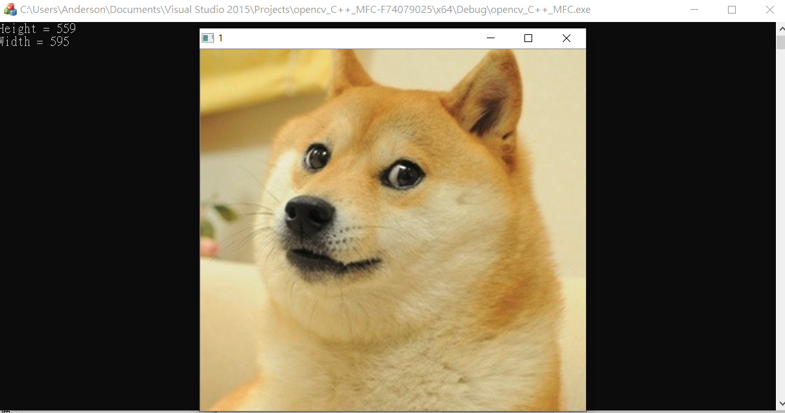
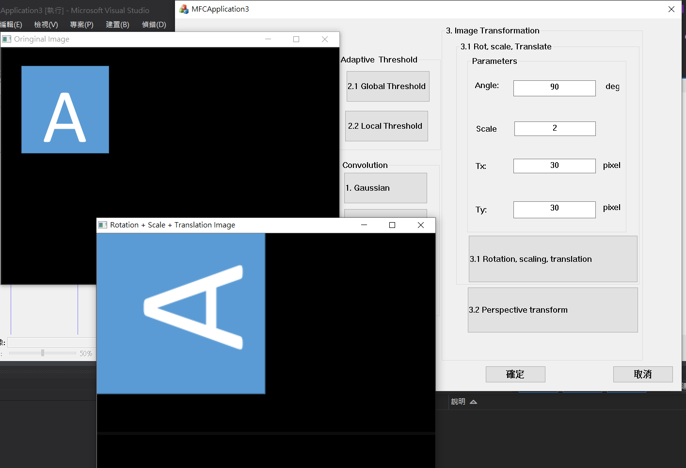

# opencv_MFC
## a. About
Learning image processing by using opencv 
## b. UI 
Using MFC to build UI

## c. function
### Image Processing
#### Load Image
Open a new window to show the image (dog.bmp)
Show the height and width of the image in console mode

#### Color Conversior
Exchange 3 channels of the image BGR to RBG
<table style="width:100%">
    <tr>
        <td></td>
        <td></td>
    </tr>
</table>

#### Image Flipping
Flip the image (dog.bmp) and open a new window to show the result.
<table style="width:100%">
    <tr>
        <td></td>
        <td></td>
    </tr>
</table>

#### Image Blemnding
Combine two images (dog.bmp and the its flip image) and Use Trackbar to change the weights and show the result in the new window.

### Adaptive threshold
#### Global Threshold
Show the result after applying global threshold.(Threshold value is 80)

#### local Threshold
Show the result after applying local threshold.(blockSize = 19, offset = -1)

### Image transformation
#### Transforms: Rotation, Scaling, Translation
rotate, scale and translate the small squared image with parameters entering in GUI

#### Perspective transform
Click 4 points showed in console window. (start from top-left corner of the original image, and then click clock-wise)
Warp the original image to the location (20,20), (20,450), (450,450), (450,20). Open second window to show the result.
<table style="width:100%">
    <tr>
        <td></td>
        <td></td>
    </tr>
</table>

### Convolution
#### Gaussian
Convert the RGB image to grayscale image and then smooth the grayscale	image by using 3x3 Gaussian smoothing filter and show the result.
<table style="width:100%">
    <tr>
        <td></td>
        <td></td>
    </tr>
</table>

#### Sobel x
Sobel edge detection to detect vertical edge 
<table style="width:100%">
    <tr>
        <td></td>
        <td></td>
    </tr>
</table>

#### Sobel y
Sobel edge detection to detect horizon edge 
<table style="width:100%">
    <tr>
        <td></td>
        <td></td>
    </tr>
</table>

#### magnitude
Use  result(sobel x and sobel y) to calculate the magnitude and show.
<table style="width:100%">
    <tr>
        <td></td>
    </tr>
</table>